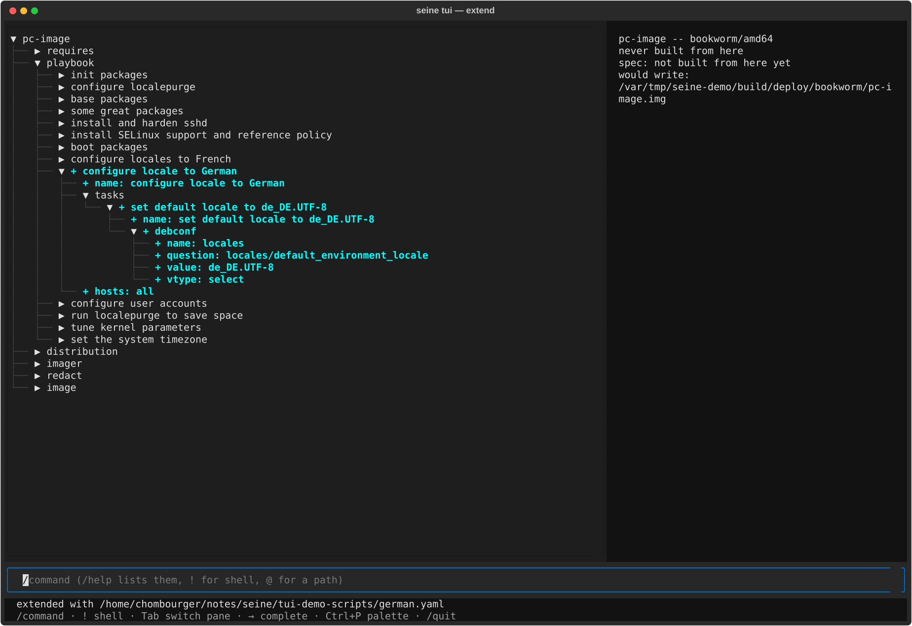
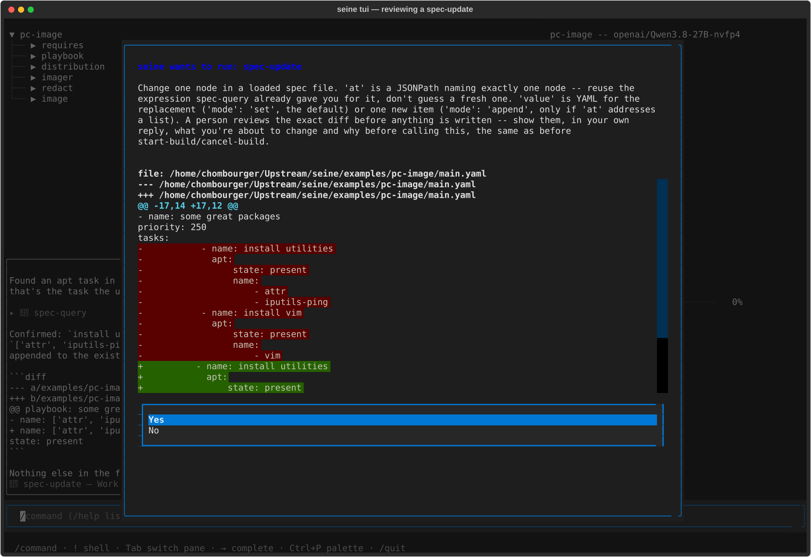
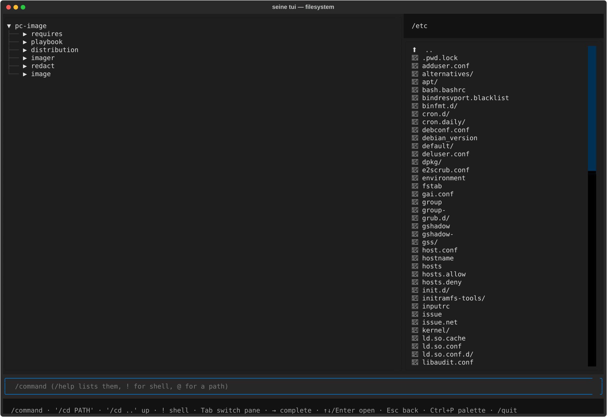
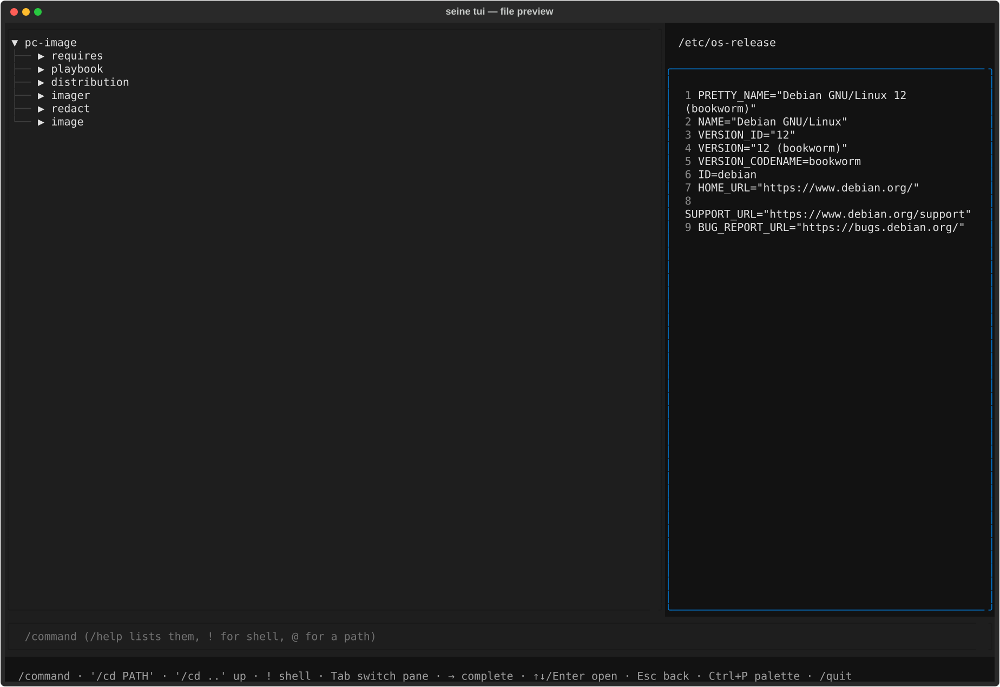
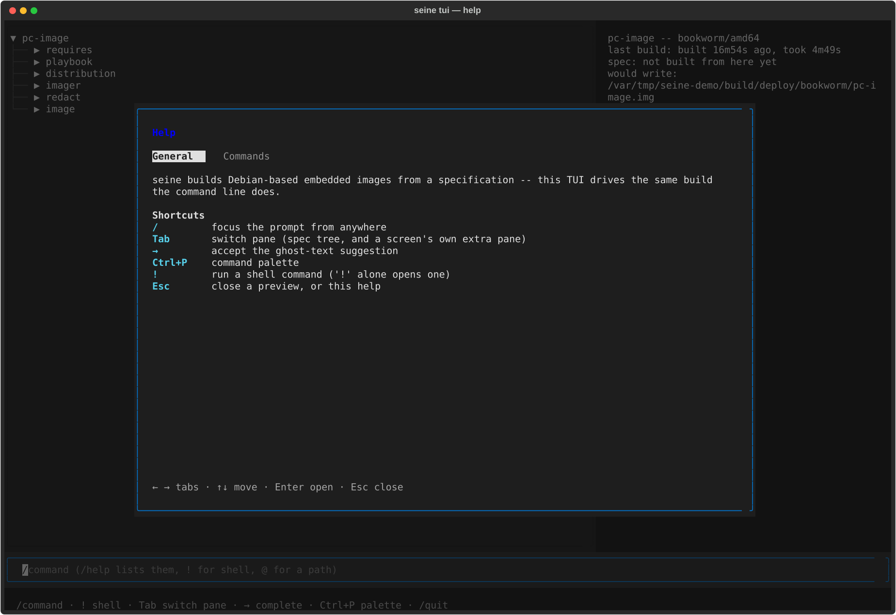
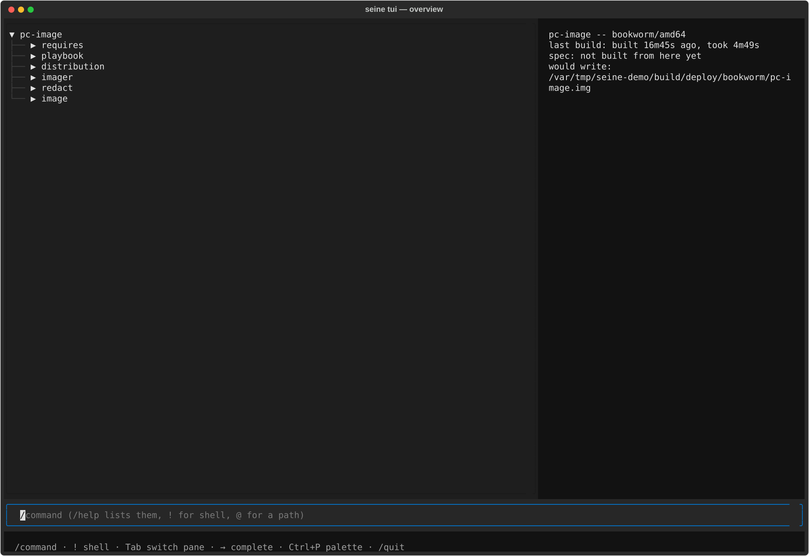
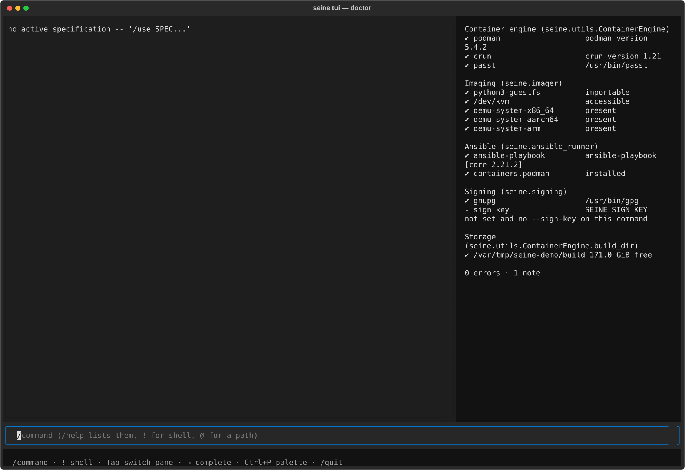
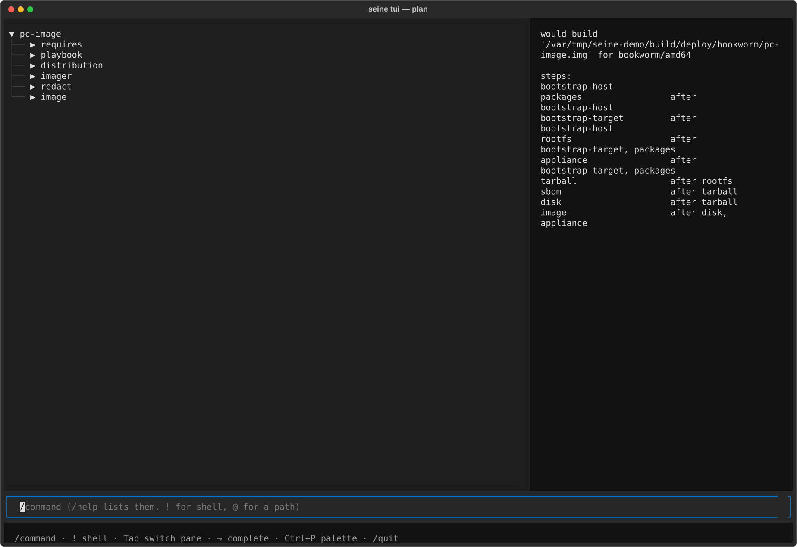

## TUI

`seine tui` is an interactive alternative to typing `seine build`/`seine plan`/
etc. one at a time -- the same engine, driven from a `/command` prompt instead
of the shell, with a screen for each thing seine can already do:

```
seine tui [SPEC...] [-- SPEC...]...
```

Needs the `tui` extra (`pip install seine[tui]`, or the `seine-tui` package) --
everything else about seine works without it. Given no `SPEC`, it opens on
[Doctor](#doctor): nothing to build without one yet, so what the machine
itself can build at all is the more useful first thing to see.


### The prompt

Every screen keeps the same prompt at the bottom. A line starting with `/` is
a command (`/build`, `/plan`, ...); `/help` lists them, with a full page per
command (see [Help](#help) below). A few other things work from any screen:

 * `/` focuses the prompt from wherever focus currently is.
 * `!command` runs a real shell command, handing it the real terminal
   and printing its exit status once it returns; a bare `!` opens an
   interactive shell the same way.
 * `→` accepts a ghost-text suggestion -- a command name as it is typed, or
   a path once `@` starts one (tab-completed against the real filesystem).
 * `Ctrl+P` opens a command palette listing every command; picking one
   fills the prompt rather than running it.
 * `↑`/`↓` recall previous lines, the same as a shell's own history.

### Focus and keyboard navigation

Every screen has (at least) two focusable panes -- the prompt, and the spec
tree beside it -- cycled with `Tab`, each getting the same highlighted
border while focused. A screen with something worth navigating gets a third:
the Build cockpit's own log tail, or the Filesystem browser's own listing.
`Esc` backs out one level at a time: a file preview to the listing it came
from, a command's own detail page to the list, Help itself to whatever
screen was open before it.

### Screens

Reached with the matching `/command` (`/help` gives the full list, with
every argument each one takes):

 * **Overview** -- the active specification, once `/use` has set one.
 * **Doctor** -- whether this machine has what a build needs: podman,
   crun, passt, guestfs, kvm, a hypervisor per architecture,
   ansible-playbook, gnupg, free space. The opening screen with no spec
   given.
 * **Plan** -- what a build would do, diffed against the last real build
   of these files, without doing any of it.
 * **Build** -- see [below](#building).
 * **Filesystem** -- see [below](#browsing-a-built-image).
 * **Artifacts**, **Packages**, **Analyze**, **Cache**, **Diff** -- the
   same information `seine analyze`/`--sbom`/`seine cache`/etc. give on
   the real command line, read for whatever `/use` last set.
 * **Issues** -- known CVEs against the active build's own SBOM (`seine
   issues` on the command line, [Vulnerability scanning](building.md#vulnerability-scanning)):
   a findings table beside summary stats.

### Composing with `/side-load`

A specification is layered rather than monolithic -- `requires` pulls in
what a release or board already sets, and `/side-load FRAGMENT.yaml` adds
one more file on top of the *active* one, live, without starting over.
`/side-unload FRAGMENT.yaml` reverses it, dropping the file back out and
reparsing without it -- neither touches `requires:` or anything on disk.
What makes this worth showing rather than just telling: the spec tree
diffs the reload against what was there a moment ago and marks exactly
what changed, auto-expanded down to the leaf that moved -- not "here is
the new merged file, go find the difference yourself":



### Talking to a model

With `llm_model`/`llm_api_base` set (`/settings`, or `SEINE_LLM_MODEL`/
`SEINE_LLM_API_BASE` as environment overrides), any prompt that doesn't
start with `/` goes to a real model instead of `commands.dispatch()`'s own
`CommandError`. It reads the same things every screen already renders --
and, with explicit approval each time, can act: changing a node, writing
a new file, loading a fragment onto the active spec:




See [ai.md](ai.md) for the full tool list and the trust model behind
what it's allowed to read.

### Building

`/build` opens a live cockpit: a scrolling log tail beside a per-step
task list, the spec tree auto-expanding and highlighting whatever it is
touching right now -- a specific package while one rebuilds from source,
or (once Ansible's own stdout says so) the exact play and task while the
target's own playbook runs:


### Browsing a built image

`/filesystem` opens a read-only browser of the *last built* image for the
active specification (not the specification itself -- it needs an image
that has actually been built). `/cd PATH` changes directory from the
prompt, same as a shell; the listing is also a real focusable list once
`Tab` reaches it -- `↑`/`↓` move, `Enter` opens whatever is highlighted:



A directory descends into it. A file that looks like text is shown in
place, line numbers dimmed in the gutter, `Esc` returning to the listing
it came from. A binary or oversized file, or any other read error, says so
on the status line without disturbing the listing already on screen:



### Help

`/help` opens as a modal overlay -- a dimmed backdrop over whatever screen
was open, not a screen navigated to, so `Esc` leaves it exactly where it
was underneath. `←`/`→` switch between two tabs:



 * **General** -- what seine is, and the shortcuts above.
 * **Commands** -- a focusable list of every command; `Enter` on one opens
   its own page, laid out the way a real `man` page is (`NAME`,
   `SYNOPSIS`, `DESCRIPTION`, and an `OPTIONS` section for a command with
   real flags, e.g. `/build`'s own `--jobs=N`). `Enter` again fills the
   prompt with that command, ready to type on; `Esc` goes back to the
   list rather than closing Help outright.

### Other screenshots

<table>
<tr><td></td>
<td></td></tr>
<tr><td></td>
<td></td></tr>
</table>
