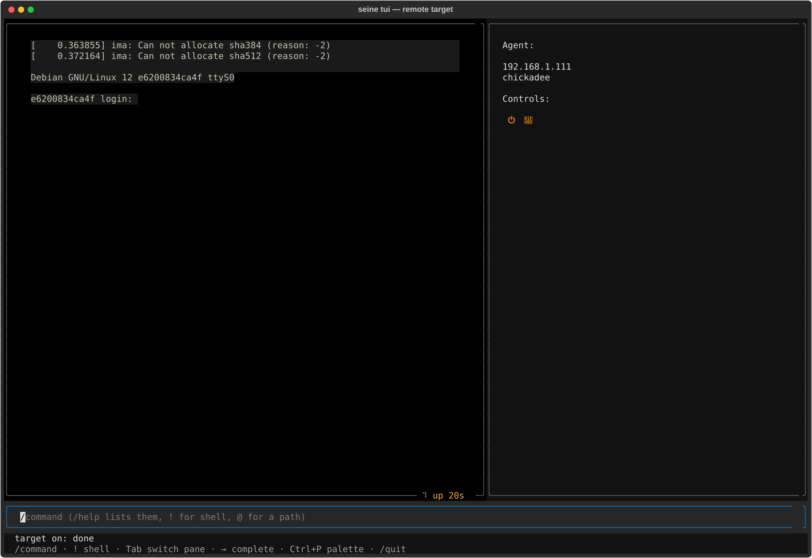

## TUI

`seine tui` is an interactive alternative to typing `seine build`/`seine plan`/
etc. one at a time -- the same engine, driven from a `/command` prompt instead
of the shell, with a screen for each thing seine can already do:

```
seine tui [SPEC...] [-- SPEC...]...
```

Needs the `tui` extra (`pip install seine[tui]`, or the `seine-tui` package) --
everything else about seine works without it. Given no `SPEC`, it opens on
[Doctor](#doctor): nothing to build without one yet, so what the machine
itself can build at all is the more useful first thing to see.


### The prompt

Every screen keeps the same prompt at the bottom. A line starting with `/` is
a command (`/build`, `/plan`, ...); `/help` lists them, with a full page per
command (see [Help](#help) below). A few other things work from any screen:

 * `/` focuses the prompt from wherever focus currently is.
 * `!command` runs a real shell command, handing it the real terminal
   and printing its exit status once it returns; a bare `!` opens an
   interactive shell the same way.
 * `→` accepts a ghost-text suggestion -- a command name as it is typed, or
   a path once `@` starts one (tab-completed against the real filesystem).
 * `Ctrl+P` opens a command palette listing every command; picking one
   fills the prompt rather than running it.
 * `↑`/`↓` recall previous lines, the same as a shell's own history.

### Focus and keyboard navigation

Every screen has (at least) two focusable panes -- the prompt, and the spec
tree beside it -- cycled with `Tab`, each getting the same highlighted
border while focused. A screen with something worth navigating gets a third:
the Build cockpit's own log tail, or the Filesystem browser's own listing.
`Esc` backs out one level at a time: a file preview to the listing it came
from, a command's own detail page to the list, Help itself to whatever
screen was open before it.

### Screens

Reached with the matching `/command` (`/help` gives the full list, with
every argument each one takes):

 * **Overview** -- the active specification, once `/use` has set one.
 * **Doctor** -- whether this machine has what a build needs: podman,
   crun, passt, guestfs, kvm, a hypervisor per architecture,
   ansible-playbook, gnupg, free space. The opening screen with no spec
   given.
 * **Plan** -- what a build would do, diffed against the last real build
   of these files, without doing any of it.
 * **Build** -- see [below](#building).
 * **Vendor** -- see [below](#vendoring).
 * **Filesystem** -- see [below](#browsing-a-built-image).
 * **Artifacts**, **Packages**, **Analyze**, **Cache**, **Diff** -- the
   same information `seine analyze`/`--sbom`/`seine cache`/etc. give on
   the real command line, read for whatever `/use` last set.
 * **Issues** -- known CVEs against the active build's own SBOM (`seine
   issues` on the command line, [Vulnerability scanning](building.md#vulnerability-scanning)):
   a findings table beside summary stats.
 * **Remote Target** -- power, console, storage and USB control for a
   real device over mtda (github.com/siemens/mtda).
 * **Test** -- runs the active specification's own `test:` section
   (Robot Framework) against a real target reached the same way.

### Composing with `/side-load`

A specification is layered rather than monolithic -- `requires` pulls in
what a release or board already sets, and `/side-load FRAGMENT.yaml` adds
one more file on top of the *active* one, live, without starting over.
`/side-unload FRAGMENT.yaml` reverses it, dropping the file back out and
reparsing without it -- neither touches `requires:` or anything on disk.
What makes this worth showing rather than just telling: the spec tree
diffs the reload against what was there a moment ago and marks exactly
what changed, auto-expanded down to the leaf that moved -- not "here is
the new merged file, go find the difference yourself":


### Talking to a model

With `llm_model`/`llm_api_base` set (`/settings`, or `SEINE_LLM_MODEL`/
`SEINE_LLM_API_BASE` as environment overrides), any prompt that doesn't
start with `/` goes to a real model instead of `commands.dispatch()`'s own
`CommandError`. It reads the same things every screen already renders --
and, with explicit approval each time, can act: changing a node, writing
a new file, loading a fragment onto the active spec:


See [ai.md](ai.md) for the full tool list and the trust model behind
what it's allowed to read.

### Building

`/build` opens a live cockpit: a scrolling log tail beside a per-step
task list, the spec tree auto-expanding and highlighting whatever it is
touching right now -- a specific package while one rebuilds from source,
or (once Ansible's own stdout says so) the exact play and task while the
target's own playbook runs:


### Vendoring

`/vendor` runs a specification's own `vendor:` section the same way
`seine vendor` does on the command line: every source package it names,
and its full build-dependency closure, resolved and fetched into a
signed apt repository of its own -- one per suite. The screen is the
same live cockpit `/build` opens, sized for what a vendor run is
instead: a stats panel (suites, task counts, retries, and how much has
been downloaded this session versus the repository's own total size)
beside a live task list. Works on a specification with no `image:`
section at all -- vendoring pins a package set, it does not build one.
`/build` and `/vendor` never run at once; starting one while the other
is running is refused, and `/cancel` stops whichever is.

### Driving a real target

`/target` opens a live console + status pane for a device reached through
mtda -- the same connection `/test` (below) uses under the hood. No spec
tree here, unlike every other screen: this one has nothing to do with a
specification. `/target connect [AGENT]` reaches one (a bare `/target`
just switches to the screen); `/target write IMAGE` flashes a built image
onto its shared storage; `on`/`off`/`toggle`, `usb PORT on|off|toggle`,
`snapshot`/`rollback` drive the rest. Two ways to type at the target: the
same prompt every other screen has (a non-'/' line goes straight to the
console instead of AI chat), or `Tab` onto the console pane itself for
raw keystrokes -- arrows, Ctrl combos, Esc -- the only way to catch
something like a PC's own "press Esc for setup" window in time:



Nothing here works without mtda installed (`seine doctor` reports it);
see [docs/testing.md](testing.md) for how `/test` drives the same
connection automatically.

### Testing on a real target

`/test [--tags=TAG,...]` runs the active specification's own `test:`
section (see [docs/testing.md](testing.md)) -- Robot Framework driven
through the same seine/mtda keywords `/target` exposes by hand:
power-cycling, logging in, running a console command, polling for a
prompt. The cockpit mirrors `/build`'s own: a per-test task list beside a
growing output tail, the spec tree auto-expanding to highlight exactly
which test is running right now:


A failed test's own message surfaces right under its row, not only in
the final summary -- the same reason a failure needs to be visible
without scrolling back. `/cancel` doesn't reach a running test yet.

### Browsing a built image

`/filesystem` opens a read-only browser of the *last built* image for the
active specification (not the specification itself -- it needs an image
that has actually been built). `/cd PATH` changes directory from the
prompt, same as a shell; the listing is also a real focusable list once
`Tab` reaches it -- `↑`/`↓` move, `Enter` opens whatever is highlighted:


A directory descends into it. A file that looks like text is shown in
place, line numbers dimmed in the gutter, `Esc` returning to the listing
it came from. A binary or oversized file, or any other read error, says so
on the status line without disturbing the listing already on screen:


### Help

`/help` opens as a modal overlay -- a dimmed backdrop over whatever screen
was open, not a screen navigated to, so `Esc` leaves it exactly where it
was underneath. `←`/`→` switch between two tabs:


 * **General** -- what seine is, and the shortcuts above.
 * **Commands** -- a focusable list of every command; `Enter` on one opens
   its own page, laid out the way a real `man` page is (`NAME`,
   `SYNOPSIS`, `DESCRIPTION`, and an `OPTIONS` section for a command with
   real flags, e.g. `/build`'s own `--jobs=N`). `Enter` again fills the
   prompt with that command, ready to type on; `Esc` goes back to the
   list rather than closing Help outright.

### External control

`seine tui --interaction-socket PATH [SPEC...]` opens a UNIX domain socket
alongside the normal terminal UI -- for driving and observing the TUI from
another process (a test driver, a scripted demo) instead of screen-scraping
a pty. Newline-delimited JSON, one object per line, in both directions.

Sent to the socket:

 * `{"type": "input", "text": "..."}` -- types `text` into the real prompt,
   character by character, then submits it (same as a person typing and
   hitting Enter).
 * `{"type": "ai_input", "prompt": "..."}` -- forwards `prompt` straight to
   the AI chat, without going through the prompt widget at all.

Received from the socket, as things happen -- a driver watches for these
instead of polling rendered text:

 * `{"type": "ai_message", "content": "..."}` -- a finished assistant reply.
 * `{"type": "ai_turn_finished"}` -- the AI chat's own turn is fully done
   (every message and gated tool call in it), the real end of "Working…".
 * `{"type": "confirm_shown", "tool", "description", "arguments", "preview"}`
   -- a gated tool's approval dialog opened (`preview` is the diff text for
   `spec-update`/`spec-create`, `null` otherwise).
 * `{"type": "confirm_resolved", "tool", "approved"}` -- that dialog closed.
 * `{"type": "spec_written", "path"}` -- `spec-update`/`spec-create`
   actually wrote `path` to disk.
 * `{"type": "build_finished", "error", "message"}` / `{"type":
   "vendor_finished", "error", "message"}` / `{"type": "test_finished",
   "error", "message"}` -- `/build` / `/vendor` / `/test` finished.
 * `{"type": "screen_changed", "screen"}` -- `/command` switched screens.
 * `{"type": "target_connected", "agent"}` / `{"type":
   "target_storage_on_host"}` / `{"type": "target_storage_write_completed",
   "path"}` -- `/target` actions completing.

### Other screenshots

<table>
<tr><td></td>
<td></td></tr>
<tr><td></td>
<td></td></tr>
</table>
